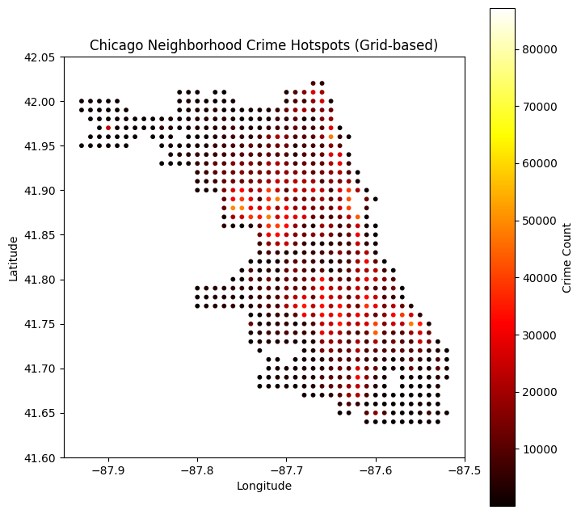
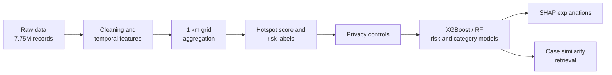
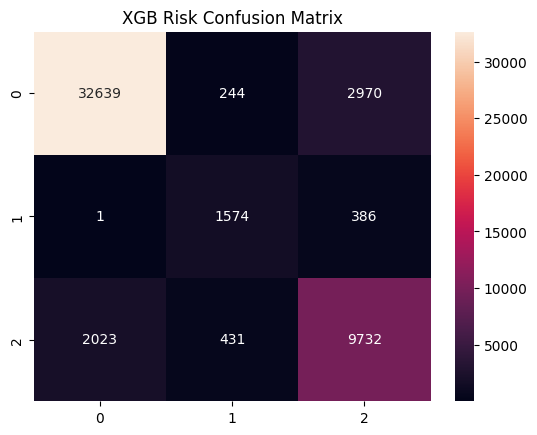
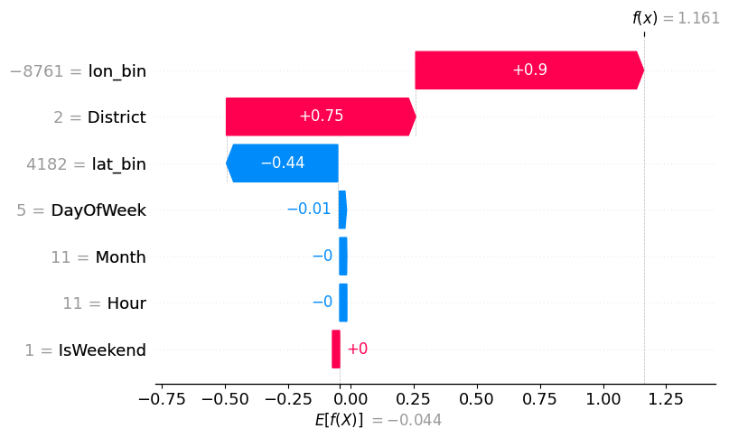
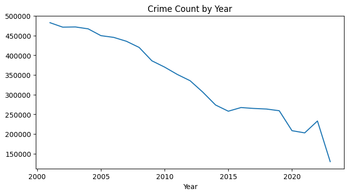
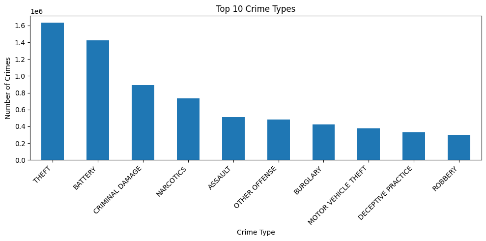

# Interpretable Crime Risk Assessment

Spatial crime risk prediction on 7.75M Chicago crime records (2001-2023) using grid-based hotspot detection, XGBoost and Random Forest, SHAP explainability and privacy-aware data handling.

<p align="center">
  
</p>

## Pipeline



## What it does

- Bins crimes into roughly 1 km grid cells, normalises counts into a hotspot score and labels each cell High, Medium or Low risk.
- Trains XGBoost and Random Forest models for two tasks: crime risk level and crime category (Property, Violent, Drug).
- Evaluates the risk model on a temporal hold-out. Labels are rebuilt per period, models train on 2001-2019 and are tested on 2020-2023, and results are compared against a persistence baseline. Class balancing is applied to the training set only.
- Explains predictions with SHAP (summary and waterfall plots) and maps the top drivers to suggested actions.
- Applies privacy controls: coordinate masking to about 100 m, k-anonymity (k=5) on rare crime types, separate public and training views of the data, and a JSON audit log.
- Retrieves the most similar historical cases for a new incident using cosine similarity.

## Results

Risk models are tested on 2020-2023 (50,000 sampled records). The test set is imbalanced (72% High), so macro F1 is the main metric.

| Task | Model | Accuracy | Macro F1 |
|---|---|---|---|
| Crime risk | Persistence baseline | 0.916 | 0.88 |
| Crime risk | XGBoost | 0.879 | 0.81 |
| Crime risk | Random Forest | 0.860 | 0.80 |
| Crime category | XGBoost | 0.487 | 0.45 |
| Crime category | Random Forest | 0.568 | 0.38 |

<p>
  
  
</p>

## Key findings

- **Crime hotspots in Chicago are highly persistent.** A baseline that simply predicts each cell's 2001-2019 risk level for 2020-2023 outperforms both models. The models have to rediscover the cell-level map from raw coordinates and lose some precision doing so.
- **Location drives risk; time barely does.** Feature importance and SHAP both show lat_bin, lon_bin and District carrying almost all the signal, with Hour, Month and DayOfWeek close to zero.
- **Crime type is hard to predict from time and location alone.** Random Forest collapses towards the majority class (Property Crime), so XGBoost's macro F1 of 0.45 is the more honest result.

<p>
  
  
</p>

## Limitations and next steps

- Add each cell's historical crime count and trend as features, so the model starts from the baseline's knowledge.
- Min-max hotspot scores are compressed by one extreme downtown cell; log scaling would spread them out.
- Case-similarity scores saturate near 0.99, so retrieval needs more discriminative features or a different distance metric.
- The dataset snapshot ends partway through 2023, which explains the drop in the yearly crime count.

## Repository structure

```
notebooks/crime_risk_assessment.ipynb   full pipeline
data/README.md                          dataset download instructions
assets/                                 figures used in this README
requirements.txt
```

## Running it

```bash
git clone https://github.com/khushigupttaa04/Interpretable-Crime-Risk-Assessment-System.git
cd Interpretable-Crime-Risk-Assessment-System
pip install -r requirements.txt
jupyter notebook notebooks/crime_risk_assessment.ipynb
```

Download the dataset into `data/` first (see `data/README.md`). On Google Colab, put the CSV in Drive and uncomment the Drive lines in Section 1. A high-RAM runtime helps with the full dataset.

## Team

- Khushi Gupta: data preprocessing, grid-based spatial aggregation, risk labelling
- Sanjhi Pareek: data security and privacy controls, case similarity system
- Priya: XGBoost and Random Forest models, SHAP explainability

Minor project, B.Tech CSE (AI/ML), UPES Dehradun.
